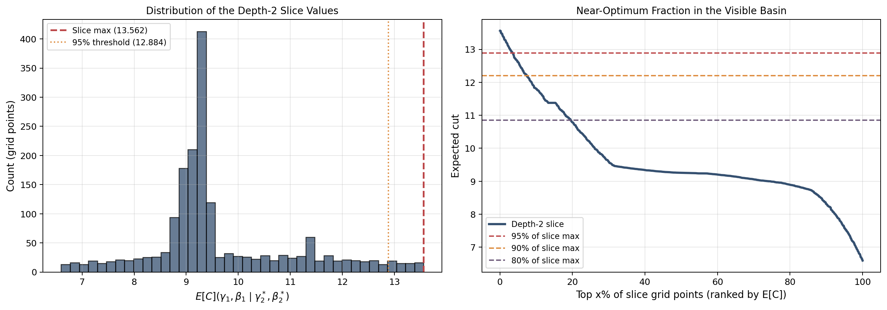
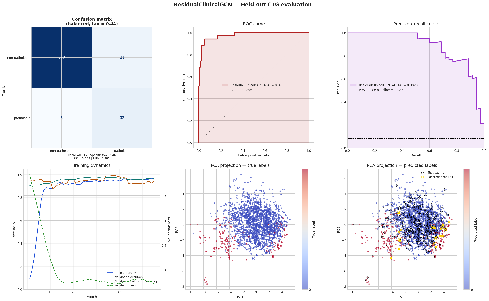
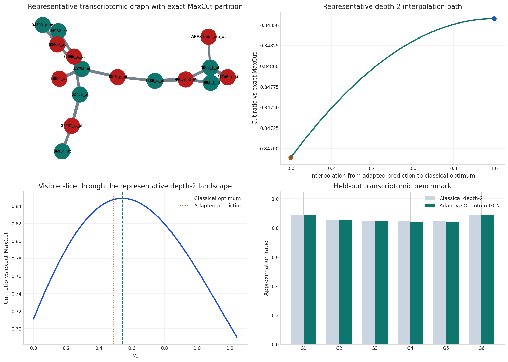
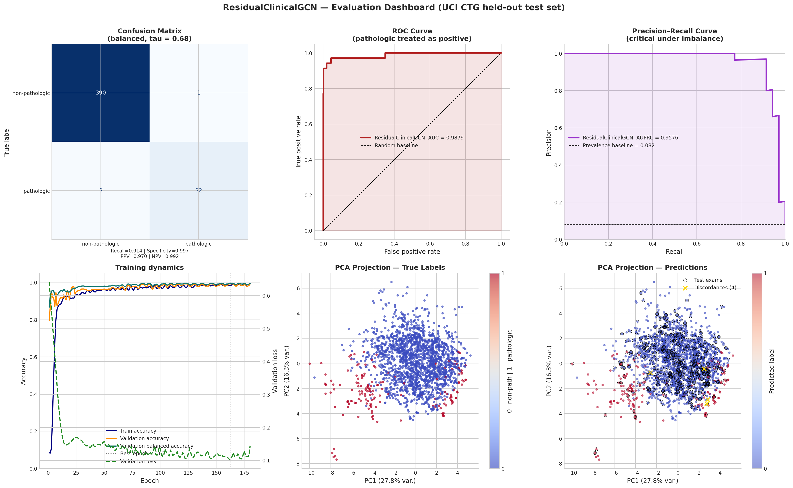

# Hybrid Quantum-Graph AI: QAOA + GNN for Biomedical Optimization

> A research-oriented repository showing how one graph-learning framework can support both QAOA warm-starting on transcriptomic graphs and clinical risk classification on physiologic similarity graphs.

[](https://thmolena.github.io/Hybrid-Quantum-Graph-AI-QAOA-GNN-Biomedical-Optimization/)

---

## Executive Summary

This project is built around a single thesis: graphs are not just a convenient data structure shared by two demos, but the common representation that makes both branches work.

- In the optimization branch, a graph neural network predicts QAOA angles from graph structure, reducing dependence on repeated classical search.
- In the biomedical branch, graph convolutional models operate on patient-exam similarity graphs to improve pathologic-risk detection.
- In the integrated branch, both ideas are presented as one graph-learning pipeline rather than separate experiments.

The repository's strongest defended results are:

| Area | Strongest reported result |
|---|---|
| QAOA warm-starting | Adaptive Quantum GCN reaches **0.868** mean held-out approximation ratio versus **0.869** for depth-2 classical QAOA, retaining **99.95%** of benchmark quality |
| Biomedical benchmark | Adaptive BioGCN reaches **96.71%** representative held-out CTG accuracy and **95.49% ± 0.97%** fixed-split robustness |
| Biomedical operating point | ResidualClinicalGCN reaches **98.8%** held-out CTG accuracy with **31 / 35** pathologic exams detected and **1** false positive |
| Integrated narrative | The combined notebook reports **35,070x** representative QAOA warm-start speedup together with the biomedical benchmark and residual evaluation story |

---

## What This Repository Shows

### 1. Quantum optimization can be graph-conditioned

The QAOA notebook turns real prostate transcriptomic data into co-expression graphs and uses an adapted GCN to predict depth-2 QAOA parameters. The point is not a generic hybrid claim, but a concrete result: the learned warm start nearly matches the held-out classical benchmark while remaining much cheaper at inference time.

### 2. Biomedical risk prediction benefits from relational structure

The CTG notebook constructs a physiologic similarity graph over 2,126 fetal monitoring exams and evaluates two model tiers:

- Adaptive BioGCN as the repository's reproducible benchmark configuration
- ResidualClinicalGCN as the stronger evaluation-focused extension

### 3. The graph abstraction is shared across both branches

The combined notebook is the main demonstration of the repository's central argument: one graph-learning formalism can support both variational quantum optimization and biomedical classification in a single end-to-end workflow.

---

## Visual Highlights

The figure assets below are stored directly in the repository, so they render in the README without depending on external hosting.

### QAOA Branch




### Biomedical Branch




### Integrated Branch





---

## Notebook Guide

### notebooks/quantum_ai_bio_combined.ipynb

Best entry point if you want the full project narrative in one pass.

- Unifies the QAOA and biomedical branches
- Presents the strongest high-level presentation of the repository thesis
- Best choice for readers who want the complete story before diving into branch-specific details

### notebooks/qaoa_demo.ipynb

Best entry point for the optimization contribution.

- Uses prostate transcriptomic data to build biologically motivated co-expression graphs
- Benchmarks exact depth-2 classical QAOA against Adaptive Quantum GCN warm starts
- Contains the strongest optimization-quality result set in the repository

### notebooks/bio_demo.ipynb

Best entry point for the biomedical contribution.

- Uses the UCI Cardiotocography cohort
- Reports both the Adaptive BioGCN benchmark and the stronger ResidualClinicalGCN evaluation
- Contains the strongest clinical operating-point analysis and robustness reporting

---

## Repository Structure

```text
Hybrid-Quantum-Graph-AI-QAOA-GNN-Biomedical-Optimization/
|- README.md
|- LICENSE
|- requirements.txt
|- model.pt
|- index.html
|- data/
|  |- breast_cancer.csv
|  |- prostate_top10_variance_panel_meta.json
|- notebooks/
|  |- bio_demo.ipynb
|  |- qaoa_demo.ipynb
|  |- quantum_ai_bio_combined.ipynb
|- outputs/
|  |- breast_cancer_expanded_processed.csv
|  |- breast_cancer_processed.csv
|  |- breast_cancer_raw.csv
|  |- ctg_processed.csv
|  |- ctg_raw.csv
|  |- maxcut_graph.csv
|  |- qaoa_classical_angles.csv
|- paper/
|  |- research_paper.md
|- scripts/
|  |- export_notebook_html.py
|- src/
|  |- data.py
|  |- gnn.py
|  |- notebook_export.py
|  |- qaoa_sim.py
|  |- server.py
|  |- train.py
|- website/
|  |- demo.js
|  |- index.html
|  |- notebook-shared.css
|  |- README_SITE.md
|  |- style.css
|  |- notebooks_html/
|     |- bio_demo.html
|     |- qaoa_demo.html
|     |- quantum_ai_bio_combined.html
|     |- figures/
```

---

## Core Implementation Notes

### src/gnn.py

The learned QAOA warm-start model is based on `SimpleGCN`.

- Output shape: `2 x p` values interpreted as QAOA angles
- Readout: global mean pooling
- Backend: PyTorch Geometric when available, dense adjacency fallback otherwise
- Current repository checkpoint: legacy depth-1 synthetic-graph model in `model.pt`

The stronger transcriptomic result is notebook-local: the QAOA notebook adapts the model on transcriptomic graph resamples and reports the improved held-out depth-2 result there.

### src/qaoa_sim.py

This module implements an exact statevector QAOA simulator.

- No external quantum framework is required
- The implementation is transparent and easy to inspect
- Complexity is exponential in qubit count, so the experiments remain in the small-graph regime

### src/server.py

The Flask server exposes the interactive prediction endpoint used by the static site.

- Route: `POST /predict`
- Input: graph edge list and optional node count
- Output: predicted `gammas`, `betas`, and expected cut value

---

## Quick Start

```bash
conda activate qaoa
pip install -r requirements.txt
python -m src.server
python -m http.server 8000
```

Then open `http://localhost:8000/` for the landing page.

If you want to reproduce the notebooks directly:

```bash
conda activate qaoa
jupyter nbconvert --to notebook --execute --inplace notebooks/qaoa_demo.ipynb
jupyter nbconvert --to notebook --execute --inplace notebooks/bio_demo.ipynb
jupyter nbconvert --to notebook --execute --inplace notebooks/quantum_ai_bio_combined.ipynb
```

If you want to refresh the static notebook HTML exports:

```bash
conda activate qaoa
python scripts/export_notebook_html.py notebooks/qaoa_demo.ipynb --output qaoa_demo.html --output-dir website/notebooks_html
python scripts/export_notebook_html.py notebooks/bio_demo.ipynb --output bio_demo.html --output-dir website/notebooks_html
python scripts/export_notebook_html.py notebooks/quantum_ai_bio_combined.ipynb --output quantum_ai_bio_combined.html --output-dir website/notebooks_html
```

---

## Generated Artifacts

| File | Description |
|---|---|
| model.pt | Trained `SimpleGCN` checkpoint used by the website demo |
| outputs/ctg_raw.csv | CTG cohort with original labels plus binary screening target |
| outputs/ctg_processed.csv | Processed CTG features with split annotations |
| outputs/maxcut_graph.csv | Edge list used in the QAOA demo |
| outputs/qaoa_classical_angles.csv | Classically optimized QAOA angles for the small-graph demo |

---

## Scope and Limitations

- The strongest optimization claims come from notebook-level depth-2 experiments, not from the website demo.
- The website demo is a depth-1 presentation layer tied to the current checkpoint and inference API.
- Exact statevector QAOA scales exponentially, so the current optimization studies are intentionally small-graph.
- The biomedical results are retrospective research outputs, not a clinical deployment system.

---

## Roadmap

### Near-term

- Promote the transcriptomic adaptation workflow from notebook-only logic into a reusable training pipeline
- Add stronger baseline comparisons for the CTG task
- Extend figure exports and website coverage for the QAOA and integrated branches

### Mid-term

- Explore richer graph construction choices for biomedical modeling
- Study deeper GCN variants and graph ablations
- Add uncertainty-aware clinical reporting

### Longer-term

- Study how graph-predicted QAOA parameters transfer to hardware-aware or noisy backends
- Use GNN predictions as warm starts for further hybrid quantum-classical refinement
- Extend graph-mediated QAOA workflows to additional biomedical network settings

---

## Draft Manuscript

The repository includes an academic-style manuscript draft at `paper/research_paper.md`.

---

## License

This project is released under the terms of the LICENSE file in this repository.
