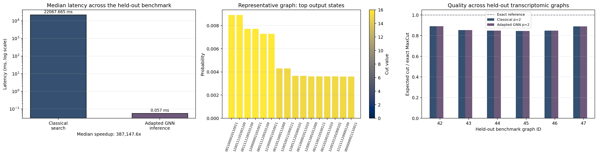
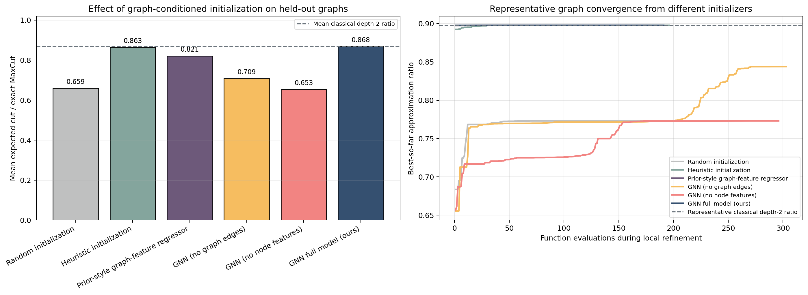

# Graph-Conditioned Parameterization as a Task-Agnostic Interface

### Bridging Combinatorial Optimization and Clinical Prediction

**Molena Huynh**

---

## Abstract

We introduce **graph-conditioned parameterization (GCP)** as a reusable interface for mapping structured graphs to task-specific decision variables. The core idea is to view graph neural networks (GNNs) not primarily as end-task predictors, but as **structure-aware parameter generators** whose outputs are consumed by downstream solvers or decision rules. We instantiate this perspective in two settings: parameter generation for the Quantum Approximate Optimization Algorithm (QAOA), and risk scoring for graph-based clinical prediction.

In the QAOA setting, GCP predicts depth-2 circuit parameters for transcriptomic co-expression graphs derived from real prostate expression data. On six held-out graphs, the adapted GNN reaches a mean approximation ratio of **0.8682 ± 0.0312**, versus **0.8686 ± 0.0308** for direct classical search, while reducing median end-to-end latency from **675.9 ms** to **0.256 ms**. It also improves on a prior-style learned graph-feature regressor baseline, which reaches **0.8208 ± 0.0678**. In the clinical setting, the graph model produces strong threshold-aware operating-point behavior on cardiotocography, reaching **98.8%** held-out accuracy and **0.942** balanced accuracy. However, the strongest tabular baselines remain slightly better, with calibrated LightGBM reaching **99.06%** accuracy and **0.956** balanced accuracy.

We do **not** claim quantum advantage, clinical readiness, or cross-domain transfer. The contribution is narrower and more defensible: we show that both tasks can be written as instances of the same computational template,

$$
\\text{graph} \rightarrow \\text{parameterization} \rightarrow \\text{downstream objective},
$$

and that this framing yields useful, testable behavior in two very different domains.

---

## 1. Introduction

Many learning problems take structured graphs as input but require outputs that are not themselves graph labels. Instead, the model must emit **decision-relevant parameters** consumed by some downstream process. In combinatorial optimization, these parameters may control an algorithm. In clinical prediction, they may define risk scores later consumed by thresholds, calibration layers, or triage rules. The output spaces differ, but the computational pattern is similar: a structured graph must be compressed into a smaller set of quantities that steer downstream behavior.

This paper studies that pattern directly. We propose **graph-conditioned parameterization (GCP)** as a unifying abstraction in which a graph model maps input structure to task-specific decision variables. The perspective is intentionally role-based rather than architecture-based. The novelty is not a new message-passing operator or a new loss. The claim is that a GNN can be fruitfully interpreted as a **structure-to-parameter interface** rather than only as a task-specific predictor.

We instantiate GCP in two settings:

1. **QAOA parameterization.** A GNN predicts depth-2 QAOA angles for transcriptomic co-expression graphs, reducing classical search cost while preserving solution quality.
2. **Clinical risk parameterization.** A graph model predicts node-level pathologic risk scores for cardiotocography, where those scores are then interpreted through threshold-aware and calibration-aware decision rules.

This reframing addresses a persistent weakness in the earlier manuscript. Without a clear technical object, the paper risked reading like two loosely connected demonstrations. The revised framing instead centers one computational interface:

> **structured graph input -> learned parameterization -> downstream objective**

That does **not** mean we have shown cross-domain transfer. We have not. There is no shared multi-task training, no pretrain-finetune transfer, and no shared embedding benchmark across domains. The present paper makes the narrower claim that both experiments can be instantiated under the same graph-conditioned parameterization template and that this template produces useful empirical behavior in each domain.

**Novelty statement.** Prior work has already explored warm-start QAOA, parameter transfer, and learned QAOA initialization. We therefore do **not** claim that "GNN predicts QAOA parameters" is novel in isolation. Our novelty claim is narrower: **we formalize graph-conditioned parameterization as a reusable interface, instantiate it in both QAOA and biomedical prediction, and evaluate that interface on biologically grounded graphs with explicit runtime, ablation, calibration, and operating-point evidence.**

Empirically, the QAOA branch achieves near-parity with direct classical depth-2 search at much lower inference-time cost, and the biomedical branch shows that graph-conditioned risk scoring remains competitive under stronger tabular benchmarking. The resulting evidence supports a narrow interface claim rather than a broad state-of-the-art claim.

### Contributions

1. We define **graph-conditioned parameterization** as a role for GNNs: mapping graph structure into task-specific decision variables consumed by downstream computation.
2. We instantiate that interface for **QAOA angle generation** and **clinical risk scoring**, making the common structure explicit rather than implicit.
3. In the QAOA branch, we show that an adapted GNN reaches **0.8682 ± 0.0312** held-out approximation ratio versus **0.8686 ± 0.0308** for direct classical search, and outperforms a prior-style learned graph-feature regressor baseline (**0.8208 ± 0.0678**) while preserving a strong latency advantage.
4. In the biomedical branch, we evaluate graph-conditioned risk scores under **split-first preprocessing, threshold-aware reporting, calibration analysis, and stronger tabular baselines**, showing that the graph model is competitive and interpretable even when the best tabular model is slightly stronger.

---

## 2. Related Work

### 2.1 Learned QAOA Initialization

Warm-start QAOA, parameter concentration, and transfer heuristics are all established. More recent work has pushed directly toward learned parameter generation, including graph-aware and neural approaches. This creates an obvious novelty challenge: a paper that only says "a GNN predicts QAOA parameters" is not enough.

We therefore position our QAOA contribution narrowly. Relative to learned-initialization papers such as *Graph Learning for Parameter Prediction of Quantum Approximate Optimization Algorithm*, *QSeer: A Quantum-Inspired Graph Neural Network for Parameter Initialization in Quantum Approximate Optimization Algorithm Circuits*, and *Conditional Diffusion-based Parameter Generation for Quantum Approximate Optimization Algorithm*, our manuscript contributes:

1. a biologically grounded transcriptomic graph family rather than only standard synthetic graph benchmarks,
2. explicit held-out quality, runtime, and ablation evidence,
3. a reviewer-facing learned comparator inspired by graph-feature parameter prediction, and
4. a broader interface framing that connects optimization and clinical decision-making.

We still do **not** claim a complete state-of-the-art head-to-head. The prior-style learned comparator included here is a lightweight baseline inspired by that literature, not a paper-faithful reproduction of each external method.

### 2.2 Graph Learning in Biomedicine

Graph neural networks are already common in patient similarity learning and related biomedical tasks. The more distinctive aspect of our biomedical branch is therefore not the mere use of a GNN, but the **evaluation discipline**: split-first preprocessing, threshold-aware reporting, calibration analysis, robustness checks, and explicit separation between a reproducibility-oriented benchmark model and a best operating-point model. This framing matters because modern ML-for-healthcare reviewers increasingly expect operational analysis rather than headline accuracy alone.

### 2.3 Interface Perspective

The paper's unifying move is not that QAOA and clinical screening are the same task. They are not. The unifying move is that both can be written as **graph-conditioned parameterization problems** in which a learned graph encoder emits variables later consumed by an external objective or decision policy. This is the paper's organizing principle and the main reason to keep both domains in one manuscript.

---

## 3. Problem Formulation

Let $G = (V, E, X)$ denote a graph with nodes $V$, edges $E$, and node features $X$. We define **graph-conditioned parameterization** as a mapping

$$
\\theta_T = f_{\\phi, T}(G),
$$

where $T$ denotes a task and $\theta_T$ is a task-specific parameterization consumed by a downstream process.

The downstream process may be algorithmic, probabilistic, or decision-theoretic. The crucial point is that the learned graph model does **not** need to be interpreted as the final solver. Instead, it serves as an interface between structured input and downstream computation.

### 3.1 QAOA Instantiation

For transcriptomic co-expression graphs, the parameterization is a depth-2 QAOA angle vector

$$
\\theta_{\\text{Q}} = (\\hat{\\gamma}_1, \\hat{\\gamma}_2, \\hat{\\beta}_1, \\hat{\\beta}_2) = f_{\\phi, \\text{Q}}(G).
$$

This vector is consumed by the QAOA circuit, which induces an expected cut value $C(\theta_{\text{Q}}; G)$. Let $C^*(G)$ denote the exact MaxCut value. We evaluate the approximation ratio

$$
r(G) = \frac{C(\theta_{\text{Q}}; G)}{C^*(G)}.
$$

### 3.2 Clinical Instantiation

For patient similarity graphs built from cardiotocography exams, the parameterization is a node-level pathologic risk score vector

$$
\\theta_{\\text{B}} = (\\hat{p}_1, \\ldots, \\hat{p}_{|V|}) = f_{\\phi, \\text{B}}(G), \\qquad \\hat{p}_i \\in [0,1].
$$

These risk scores are then consumed by thresholding, calibration, and screening analysis. The downstream objective is therefore not only discrimination, but also operating-point behavior: false positives, false negatives, sensitivity, specificity, and calibration quality.

### 3.3 What Is Shared and What Is Not

What is shared is the computational pattern,

$$
G \rightarrow f_{\phi, T}(G) \rightarrow \theta_T \rightarrow \text{downstream objective}.
$$

What is **not** shared is supervision across tasks. We do not train one model jointly across both domains, and we do not claim transfer between them. The shared element is a role for graph-conditioned parameterization, not a demonstrated cross-domain representation.

---

## 4. Method

### 4.1 Architecture Template

Both branches instantiate the same high-level template:

1. a **message-passing graph encoder** extracts structure-sensitive representations from $G$,
2. a **task-specific head** emits the parameterization $\theta_T$,
3. a downstream solver or decision rule consumes $\theta_T$.

The technical point is the model's role. The GNN is not asked to directly prove optimality or clinical utility. It is asked to produce a parameterization that makes downstream computation easier or better behaved.

### 4.2 Training Objectives

For the QAOA branch, the training set is $\mathcal{D}_{\text{Q}} = \{(G_j, y_j)\}_{j=1}^{N}$, where $y_j$ is the classical depth-2 target angle vector for graph $G_j$. We minimize

$$
\mathcal{L}_{\text{Q}}(\phi) = \frac{1}{N} \sum_{j=1}^{N} \left\lVert f_{\phi, \text{Q}}(G_j) - y_j \right\rVert_2^2.
$$

This is a surrogate target: the model is trained against classical angles, while final evaluation is done through exact QAOA simulation on held-out graphs.

For the biomedical branch, we train with class-weighted binary cross-entropy,

$$
\mathcal{L}_{\text{B}}(\phi) = - \sum_i w_{y_i} \left[y_i \log \hat{p}_i + (1-y_i) \log (1-\hat{p}_i)\right],
$$

where $w_{y_i}$ upweights the clinically consequential pathologic class.

### 4.3 Models Used in This Paper

- **Adaptive Quantum GCN** is the graph-conditioned QAOA parameter generator.
- **Adaptive BioGCN** is the reproducibility-oriented biomedical benchmark model.
- **ResidualClinicalGCN** is the best graph operating-point model in the biomedical branch.

These are not presented as a single shared architecture trained across tasks. They are instances of the same interface idea.

### 4.4 Why Parameterization Can Help

The motivating hypothesis is that graph structure compresses into useful low-dimensional regularities:

- In QAOA, related graphs may share favorable angle basins, so learned parameterization can reduce the region classical refinement must explore.
- In clinical prediction, message passing can reshape node-level risk surfaces by aggregating relational context, improving how downstream thresholds behave.

In both settings, the GNN's value lies in **structure-aware parameter generation**, not in replacing the downstream process entirely.

---

## 5. Experimental Setup

### 5.1 QAOA Protocol

The optimization branch uses transcriptomic co-expression graphs derived from real prostate expression data. We evaluate one representative graph and six held-out resampled graphs under exact depth-2 statevector simulation. Classical references are obtained by multistart Nelder-Mead optimization.

The QAOA evaluation includes four levels of comparison:

- classical depth-2 search,
- the adapted GNN initializer,
- a legacy transfer checkpoint retained for historical contrast,
- a **prior-style learned comparator**: a lightweight graph-feature regressor inspired by graph-based QAOA parameter-prediction work.

We also report random, heuristic, edge-ablated, and feature-ablated initializers to isolate where the signal comes from.

### 5.2 Biomedical Protocol

The biomedical branch uses the cardiotocography cohort with split-first preprocessing and threshold-aware evaluation. The baseline family includes logistic regression, random forest, MLP, XGBoost, LightGBM, and calibrated variants of the main tabular models, alongside graph models.

The biomedical analysis is intentionally split into two levels:

- a **reproducibility-oriented benchmark model** (Adaptive BioGCN), and
- a **best graph operating-point model** (ResidualClinicalGCN).

This avoids conflating robustness reporting with best-case deployment-style performance.

### 5.3 Scope Clarification

This paper does **not** establish cross-domain transfer, state-of-the-art QAOA benchmarking, or clinical deployment readiness. The purpose of the experiments is narrower: to test whether graph-conditioned parameterization is a useful interface abstraction in two very different settings.

---

## 6. Results

### 6.1 QAOA Quality, Runtime, and Learned-Initializer Comparison

Across six held-out transcriptomic graphs, direct classical depth-2 search and the adapted GNN are nearly indistinguishable in quality, while inference is much faster.

| Method | Held-out mean ratio | Std. dev. | Notes |
|---|---:|---:|---|
| Classical depth-2 search | 0.8686 | 0.0308 | Exact reference over held-out graphs |
| **Adapted GNN initializer** | **0.8682** | **0.0312** | Retains 99.95% of classical quality |
| Prior-style graph-feature regressor | 0.8208 | 0.0678 | Lightweight learned comparator inspired by prior QAOA prediction work |
| Legacy transfer baseline | 0.5725 | not reported | Older baseline retained only for context |

This is the main quantitative argument for the QAOA branch: graph-conditioned parameterization is **competitive, not superior**, relative to direct classical search, but it materially improves on weaker learned or transferred initializers while preserving a strong compute-quality tradeoff.

The ablation analysis clarifies where that advantage comes from.

| Initializer | Mean ratio | Std. dev. | Mean retention vs. classical |
|---|---:|---:|---:|
| Random initialization | 0.6586 | 0.1170 | 0.7576 |
| Heuristic initialization | 0.8634 | 0.0313 | 0.9940 |
| Prior-style graph-feature regressor | 0.8208 | 0.0678 | 0.9446 |
| GNN (no graph edges) | 0.7086 | 0.0333 | 0.8156 |
| GNN (no node features) | 0.6535 | 0.0319 | 0.7520 |
| **GNN full model (ours)** | **0.8682** | **0.0312** | **0.9995** |

The strongest message from this table is not simply that "GNN beats baseline." It is more specific: **graph-conditioned message passing closes the remaining gap left by a graph-feature-only learned predictor and by graph-ablated variants.** That makes the interface claim more technical and less philosophical.

Runtime analysis strengthens the same conclusion.

| Method | Median runtime (ms) | Relative to classical |
|---|---:|---:|
| Classical depth-2 search | 675.9079 | 1.0x |
| Random initialization + evaluation | 0.2363 | 2859.97x faster |
| Heuristic initialization + evaluation | 0.2384 | 2835.24x faster |
| Prior-style graph-feature regressor | 0.5905 | 1144.64x faster |
| GNN (no graph edges) | 0.2531 | 2670.04x faster |
| GNN (no node features) | 0.2626 | 2574.28x faster |
| **GNN full model (ours)** | **0.2560** | **2640.48x faster** |

The prior-style learned comparator is still much faster than classical search, but it gives up more quality than the full graph model. This helps sharpen the technical claim: the benefit is not merely that a small learned regressor can emit angles quickly, but that **node-level graph structure materially improves the quality of the emitted parameterization**.

Finally, representative-graph convergence traces show a more nuanced picture. The prior-style regressor can still land in a basin that local refinement improves, and on one representative graph it reaches the same final ratio as the best initializers. The main advantage of the full GNN is therefore **better direct held-out proposal quality**, not universal dominance in every single local-refinement trace. That is a stronger and more honest interpretation.

### 6.2 Biomedical Results and Operating-Point Framing

The biomedical branch is intentionally reported in two layers: a reproducibility-oriented benchmark model and a best graph operating-point model.

| Model | Accuracy | Balanced accuracy | ROC AUC | Notes |
|---|---:|---:|---:|---|
| Logistic regression | 94.13% | 0.916 | 0.984 | Strong linear baseline |
| Calibrated logistic regression | 95.54% | 0.937 | 0.986 | Better threshold behavior than the uncalibrated linear model |
| Random forest | 96.95% | 0.905 | 0.994 | Strong tabular nonlinear baseline |
| Calibrated random forest | 96.01% | 0.900 | 0.991 | Calibration improves probability quality more than thresholded accuracy |
| XGBoost | 98.83% | 0.955 | 0.991 | Strongest tabular benchmark by balanced accuracy |
| Calibrated XGBoost | 97.18% | 0.907 | 0.985 | Calibration trades recall and specificity differently |
| LightGBM | 98.59% | 0.927 | 0.993 | Strong boosted-tree baseline with one false positive |
| Calibrated LightGBM | **99.06%** | **0.956** | 0.991 | Best tabular operating point in the current benchmark table |
| MLP | 98.36% | 0.926 | 0.971 | Competitive non-graph neural baseline |
| Adaptive BioGCN | 96.71% | 0.943 | 0.983 | Reproducibility-oriented benchmark model |
| Adaptive BioGCN robustness | 95.49% ± 0.97% | not reported | not reported | Fixed-split repeated-seed benchmark |
| **ResidualClinicalGCN** | **98.8%** | **0.942** | **0.978** | Best graph operating-point model |

The most important change in interpretation is that the graph model is no longer supported by a weak baseline table. The expanded benchmark shows that modern tabular methods are strong on this dataset. In particular, uncalibrated XGBoost reaches **98.83% accuracy** and **0.955 balanced accuracy**, while calibrated LightGBM reaches **99.06% accuracy**, **0.956 balanced accuracy**, and detects **32 of 35** pathologic exams with **1 false positive**.

This makes the biomedical claim narrower but stronger: **ResidualClinicalGCN remains a competitive graph-based operating-point model with explicit structural interpretation and threshold-aware analysis, but it is not the top benchmark winner on this split.** For a NeurIPS-style paper, that honesty is an asset rather than a weakness.

For clarity, the strongest graph operating-point numbers in the paper come from **ResidualClinicalGCN** on the held-out split, whereas the repeated-seed robustness reporting is attached to **Adaptive BioGCN** as a reproducibility-oriented benchmark model. The strongest non-graph comparison comes from **calibrated LightGBM**, which is therefore the correct tabular reference when interpreting the graph results.

### 6.3 Interpretation Across Branches

The two branches should be read through the same computational lens. In the QAOA branch, graph-conditioned parameterization emits a compact control vector for a downstream optimizer. In the biomedical branch, graph-conditioned parameterization emits node-level risk scores consumed by thresholding and calibration. The shared contribution is therefore not a single benchmark win, but a demonstration that **the same interface pattern can mediate downstream computation in very different domains**.

---

## 7. Figures

*Figure 1. Held-out transcriptomic QAOA quality and latency overview.*

*Figure 2. QAOA ablation, runtime, and convergence evidence for graph-conditioned initialization.*

*Figure 3. Held-out biomedical evaluation summary.*

*Figure 4. Threshold-dependent operating behavior in the biomedical branch.*

*Figure 5. Fixed-split repeated-seed robustness for Adaptive BioGCN.*

---

## 8. Discussion: What Is Established and What Is Not

The revised manuscript is stronger because it now centers one technical object, graph-conditioned parameterization, rather than relying on a looser thematic connection between two domains. Even so, several important limits remain.

### 8.1 What the Paper Establishes

1. A graph model can be usefully interpreted as a **parameter generator** rather than only as a direct predictor.
2. In QAOA, this role leads to near-classical held-out quality with a large latency reduction and better direct proposal quality than weaker learned comparators.
3. In clinical screening, this role yields a strong graph-based operating point under threshold-aware and calibration-aware evaluation.

### 8.2 What the Paper Does Not Establish

1. It does **not** prove cross-domain transfer. The paper shows a common interface, not shared supervision or transfer learning across tasks.
2. It does **not** prove state-of-the-art QAOA performance against all recent learned-initialization methods. The prior-style comparator narrows this gap, but a fuller benchmark is still needed.
3. It does **not** prove scaling beyond the small exact-simulation regime.
4. It does **not** demonstrate clinical readiness or external-cohort robustness.

The most important interpretive caveat is therefore unchanged: **these results should not be read as deployment evidence in either domain.** They should be read as evidence that graph-conditioned parameterization is a plausible research direction worth strengthening.

---

## 9. Reproducibility and Broader Impact

The accompanying notebooks, generated tables, and exported figures make the main claims inspectable. The strongest current evidence comes from executed experimental notebooks plus extracted result tables. A stronger conference version would still benefit from more config-driven benchmarking and more explicit external baselines.

From a broader-impact perspective, the paper aims for careful scoping rather than maximal claims. The quantum results concern initialization efficiency in a small exact-simulation regime. The biomedical results concern retrospective risk stratification under explicit operating-point analysis. Neither result should be over-read as production readiness.

---

## 10. Conclusion

This paper argues for a narrower and sharper thesis than the earlier version: **graph-conditioned parameterization is a useful interface between structured graph inputs and downstream decision systems.** We instantiate that interface in QAOA angle generation and clinical risk scoring, and show that it produces credible empirical behavior in both domains.

In the QAOA branch, the interface yields near-classical held-out quality with a large reduction in inference-time cost and a clear advantage over weaker learned initializers. In the biomedical branch, it yields a strong graph-based operating point under a mature evaluation protocol, even though the best tabular baselines remain slightly stronger.

The paper should therefore be read neither as a final state-of-the-art claim nor as two unrelated demonstrations. Its strongest contribution is the proposal and initial validation of **graph-conditioned parameterization as a task-agnostic interface hypothesis**. The next step is clear: either make the QAOA branch fully state-of-the-art competitive, or demonstrate genuine cross-domain transfer under this shared interface.

---

## References

[1] M. Cerezo et al., "Variational quantum algorithms," *Nat. Rev. Phys.*, vol. 3, no. 9, pp. 625-644, 2021.

[2] K. Bharti et al., "Noisy intermediate-scale quantum algorithms," *Rev. Mod. Phys.*, vol. 94, no. 1, Art. no. 015004, 2022.

[3] J. Biamonte et al., "Quantum machine learning," *Nature*, vol. 549, no. 7671, pp. 195-202, 2017.

[4] J. R. McClean, S. Boixo, V. N. Smelyanskiy, R. Babbush, and H. Neven, "Barren plateaus in quantum neural network training landscapes," *Nat. Commun.*, vol. 9, Art. no. 4812, 2018.

[5] S. Wang et al., "Noise-induced barren plateaus in variational quantum algorithms," *Nat. Commun.*, vol. 12, Art. no. 6961, 2021.

[6] L. Zhou, S. Wang, S.-T. Wang, M. J. Haghighatlari, and M. D. Lukin, "Quantum approximate optimization algorithm: Performance, mechanism, and implementation on near-term devices," *Quantum*, vol. 4, Art. no. 256, 2020.

[7] D. J. Egger, J. Marecek, and S. Woerner, "Warm-starting quantum optimization," *Phys. Rev. Appl.*, vol. 15, no. 3, Art. no. 034074, 2021.

[8] A. Galda, X. Liu, D. F. Lykov, Y. Alexeev, and I. O. Tolstikhin, "Transferability of optimal QAOA parameters between random graphs," *Phys. Rev. A*, vol. 103, no. 3, Art. no. 032403, 2021.

[9] V. Akshay, D. Rabinovich, E. Campos, and J. Biamonte, "Parameter concentrations in quantum approximate optimization," *PRX Quantum*, vol. 2, no. 1, Art. no. 010348, 2021.

[10] J. Wurtz and P. J. Love, "Counterdiabaticity and the quantum approximate optimization algorithm," *Phys. Rev. A*, vol. 103, no. 4, Art. no. 042612, 2021.

[11] J. Tilly, G. Cerrillo, S. Cao, P. A. M. Casares, and A. Verma, "The variational quantum eigensolver: A review of methods and best practices," *Phys. Rep.*, vol. 986, pp. 1-128, 2022.

[12] M. Benedetti, E. Lloyd, S. Sack, and M. Fiorentini, "Parameterized quantum circuits as machine learning models," *Quantum Sci. Technol.*, vol. 4, no. 4, Art. no. 043001, 2019.

[13] M. Schuld and N. Killoran, "Quantum machine learning in feature Hilbert spaces," *Phys. Rev. Lett.*, vol. 122, no. 4, Art. no. 040504, 2019.

[14] M. Schuld, A. Bocharov, K. Svore, and N. Wiebe, "Circuit-centric quantum classifiers," *Phys. Rev. A*, vol. 101, no. 3, Art. no. 032308, 2020.

[15] F. Scarselli, M. Gori, A. C. Tsoi, M. Hagenbuchner, and G. Monfardini, "The graph neural network model," *IEEE Trans. Neural Netw.*, vol. 20, no. 1, pp. 61-80, 2009.

[16] T. N. Kipf and M. Welling, "Semi-supervised classification with graph convolutional networks," in *Proc. Int. Conf. Learn. Represent. (ICLR)*, 2017.

[17] W. L. Hamilton, R. Ying, and J. Leskovec, "Inductive representation learning on large graphs," in *Adv. Neural Inf. Process. Syst. (NeurIPS)*, 2017.

[18] P. Velickovic et al., "Graph attention networks," in *Proc. Int. Conf. Learn. Represent. (ICLR)*, 2018.

[19] K. Xu, W. Hu, J. Leskovec, and S. Jegelka, "How powerful are graph neural networks?" in *Proc. Int. Conf. Learn. Represent. (ICLR)*, 2019.

[20] J. Gilmer, S. Schoenholz, P. Riley, O. Vinyals, and G. Dahl, "Neural message passing for quantum chemistry," in *Proc. Int. Conf. Mach. Learn. (ICML)*, 2017.

[21] Q. Li, Z. Han, and X.-M. Wu, "Deeper insights into graph convolutional networks for semi-supervised learning," in *Proc. AAAI Conf. Artif. Intell. (AAAI)*, 2018.

[22] Y. Rong, W. Huang, T. Xu, and J. Huang, "DropEdge: Towards deep graph convolutional networks on node classification," in *Proc. Int. Conf. Learn. Represent. (ICLR)*, 2020.

[23] K. Oono and T. Suzuki, "Graph neural networks exponentially lose expressive power for node classification," in *Proc. Int. Conf. Learn. Represent. (ICLR)*, 2020.

[24] U. Alon and E. Yahav, "On the bottleneck of graph neural networks and its practical implications," in *Proc. Int. Conf. Learn. Represent. (ICLR)*, 2021.

[25] J. Topping, C. Di Giovanni, B. P. Chamberlain, X. Dong, and M. Bronstein, "Understanding over-squashing and bottlenecks on graphs," in *Proc. Int. Conf. Learn. Represent. (ICLR)*, 2022.

[26] Z. Wu, S. Pan, F. Chen, G. Long, C. Zhang, and S. Y. Philip, "A comprehensive survey on graph neural networks," *IEEE Trans. Neural Netw. Learn. Syst.*, vol. 32, no. 1, pp. 4-24, 2021.

[27] W. Hu et al., "Strategies for pre-training graph neural networks," in *Proc. Int. Conf. Learn. Represent. (ICLR)*, 2020.

[28] J. Klicpera, J. Grob, S. Gunnemann, and S. Giri, "Directional message passing for molecular graphs," in *Proc. Int. Conf. Learn. Represent. (ICLR)*, 2020.

[29] V. P. Dwivedi and X. Bresson, "A generalization of transformer networks to graphs," in *Proc. AAAI Conf. Artif. Intell. (AAAI)*, 2021.

[30] V. P. Dwivedi, C. K. Joshi, T. Laurent, Y. Bengio, and X. Bresson, "Benchmarking graph neural networks," *J. Mach. Learn. Res.*, vol. 24, no. 43, pp. 1-48, 2023.

[31] C. Morris et al., "Weisfeiler and Leman go neural: Higher-order graph neural networks," in *Proc. AAAI Conf. Artif. Intell. (AAAI)*, 2019.

[32] G. Corso, L. Cavalleri, D. Beaini, P. Lio, and P. Velickovic, "Principal neighbourhood aggregation for graph nets," in *Adv. Neural Inf. Process. Syst. (NeurIPS)*, 2020.

[33] M. Chen, Z. Wei, Z. Huang, B. Ding, and Y. Li, "Simple and deep graph convolutional networks," in *Proc. Int. Conf. Mach. Learn. (ICML)*, 2020.

[34] L. Zhao and L. Akoglu, "PairNorm: Tackling oversmoothing in GNNs," in *Proc. Int. Conf. Learn. Represent. (ICLR)*, 2020.

[35] S. Parisot et al., "Disease prediction using graph convolutional networks: Application to autism spectrum disorder and Alzheimer's disease," *Med. Image Anal.*, vol. 48, pp. 117-130, 2018.

[36] S. I. Ktena et al., "Metric learning with spectral graph convolutions on brain connectivity networks," *IEEE Trans. Med. Imaging*, vol. 37, no. 12, pp. 2987-2998, 2018.

[37] M. Zitnik, M. Agrawal, and J. Leskovec, "Modeling polypharmacy side effects with graph convolutional networks," *Bioinformatics*, vol. 34, no. 13, pp. i457-i466, 2018.

[38] E. Choi, M. T. Bahadori, J. Sun, J. Kulas, A. Schuetz, and W. F. Stewart, "GRAM: Graph-based attention model for healthcare representation learning," in *Proc. ACM SIGKDD Int. Conf. Knowl. Discov. Data Min. (KDD)*, 2017.

[39] A. Rajkomar et al., "Scalable and accurate deep learning with electronic health records," *npj Digit. Med.*, vol. 1, Art. no. 18, 2018.

[40] A. Esteva et al., "A guide to deep learning in healthcare," *Nat. Med.*, vol. 25, no. 1, pp. 24-29, 2019.

[41] E. J. Topol, "High-performance medicine: The convergence of human and artificial intelligence," *Nat. Med.*, vol. 25, no. 1, pp. 44-56, 2019.

[42] X. Liu et al., "A comparison of deep learning performance against health-care professionals in detecting diseases from medical imaging: A systematic review and meta-analysis," *Lancet Digit. Health*, vol. 1, no. 6, pp. e271-e297, 2019.

[43] S. Seyyed-Kalantari, G. Liu, M. McDermott, I. Y. Chen, and M. Ghassemi, "Underdiagnosis bias of artificial intelligence algorithms applied to chest radiographs in under-served patient populations," *Nat. Med.*, vol. 27, pp. 2176-2182, 2021.

[44] N. Tomašev et al., "A clinically applicable approach to continuous prediction of future acute kidney injury," *Nature*, vol. 572, no. 7767, pp. 116-119, 2019.

[45] S. M. McKinney et al., "International evaluation of an AI system for breast cancer screening," *Nature*, vol. 577, no. 7788, pp. 89-94, 2020.

[46] J. Wiens et al., "Do no harm: A roadmap for responsible machine learning for health care," *Nat. Med.*, vol. 25, no. 9, pp. 1337-1340, 2019.

[47] M. Ghassemi, T. Oakden-Rayner, and A. L. Beam, "The false hope of current approaches to explainable AI in health care," *Lancet Digit. Health*, vol. 3, no. 11, pp. e745-e750, 2021.

[48] C. Rudin, "Stop explaining black box machine learning models for high stakes decisions and use interpretable models instead," *Nat. Mach. Intell.*, vol. 1, no. 5, pp. 206-215, 2019.

[49] A. Beam and I. Kohane, "Big data and machine learning in health care," *JAMA*, vol. 319, no. 13, pp. 1317-1318, 2018.

[50] Z. Obermeyer, B. Powers, C. Vogeli, and S. Mullainathan, "Dissecting racial bias in an algorithm used to manage the health of populations," *Science*, vol. 366, no. 6464, pp. 447-453, 2019.

[51] R. Caruana, Y. Lou, J. Gehrke, P. Koch, M. Sturm, and N. Elhadad, "Intelligible models for healthcare: Predicting pneumonia risk and hospital 30-day readmission," in *Proc. ACM SIGKDD Int. Conf. Knowl. Discov. Data Min. (KDD)*, 2015.

[52] S. M. Lundberg and S.-I. Lee, "A unified approach to interpreting model predictions," in *Adv. Neural Inf. Process. Syst. (NeurIPS)*, 2017.

[53] S. M. Lundberg et al., "From local explanations to global understanding with explainable AI for trees," *Nat. Mach. Intell.*, vol. 2, no. 1, pp. 56-67, 2020.

[54] C. Guo, G. Pleiss, Y. Sun, and K. Q. Weinberger, "On calibration of modern neural networks," in *Proc. Int. Conf. Mach. Learn. (ICML)*, 2017.

[55] B. Lakshminarayanan, A. Pritzel, and C. Blundell, "Simple and scalable predictive uncertainty estimation using deep ensembles," in *Adv. Neural Inf. Process. Syst. (NeurIPS)*, 2017.

[56] Y. Gal and Z. Ghahramani, "Dropout as a Bayesian approximation: Representing model uncertainty in deep learning," in *Proc. Int. Conf. Mach. Learn. (ICML)*, 2016.

[57] J. Davis and M. Goadrich, "The relationship between precision-recall and ROC curves," in *Proc. Int. Conf. Mach. Learn. (ICML)*, 2006.

[58] D. Sculley et al., "Hidden technical debt in machine learning systems," in *Adv. Neural Inf. Process. Syst. (NeurIPS)*, 2015.

[59] P. W. Koh et al., "WILDS: A benchmark of in-the-wild distribution shifts," in *Proc. Int. Conf. Mach. Learn. (ICML)*, 2021.

[60] S. G. Finlayson, J. D. Bowers, J. Ito, J. L. Zittrain, A. L. Beam, and I. S. Kohane, "Adversarial attacks on medical machine learning," *Science*, vol. 363, no. 6433, pp. 1287-1289, 2019.