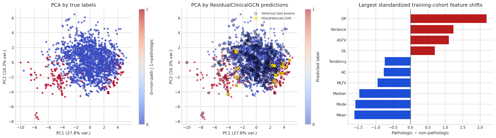
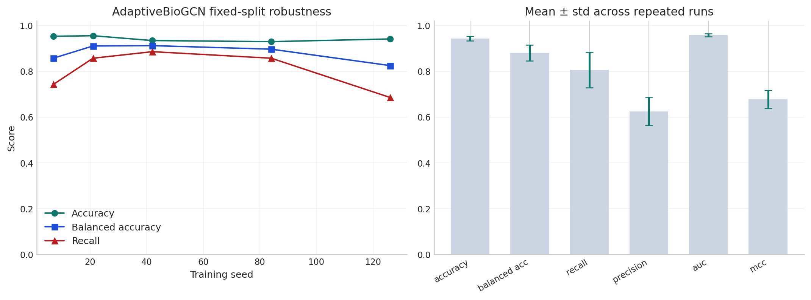
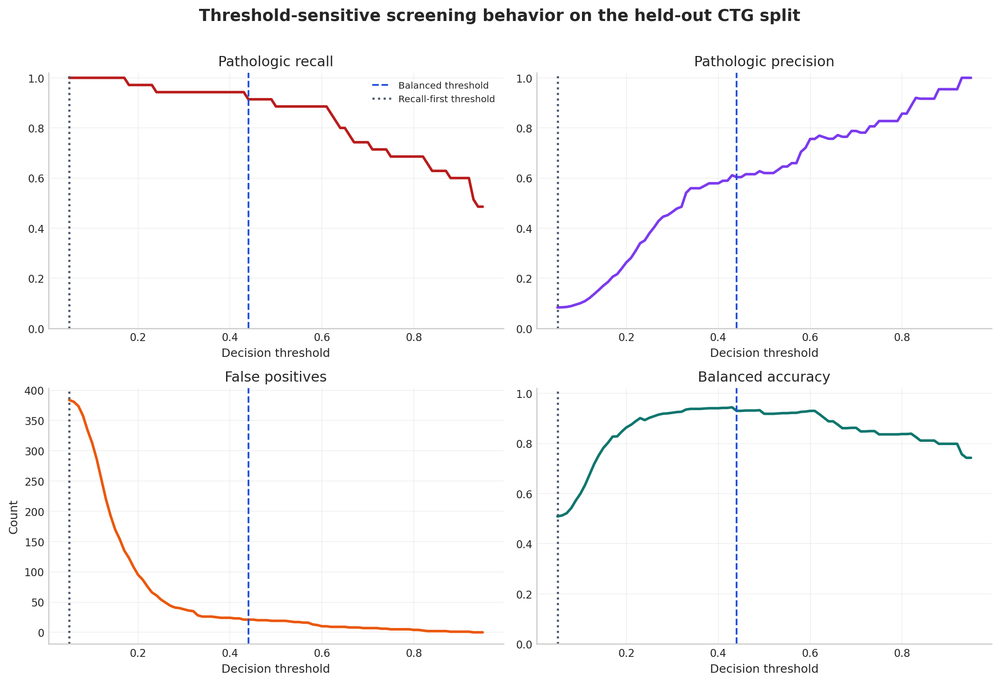
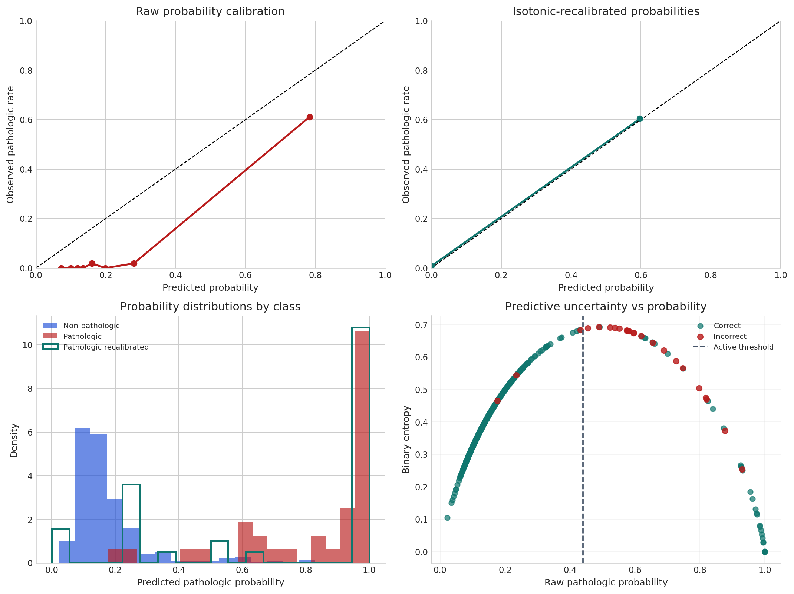
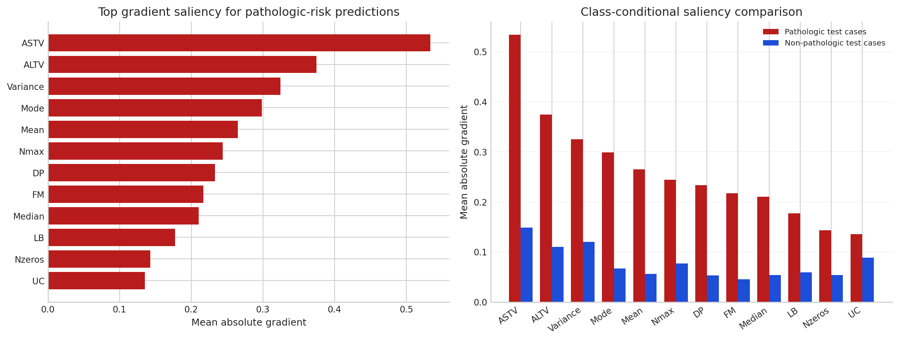
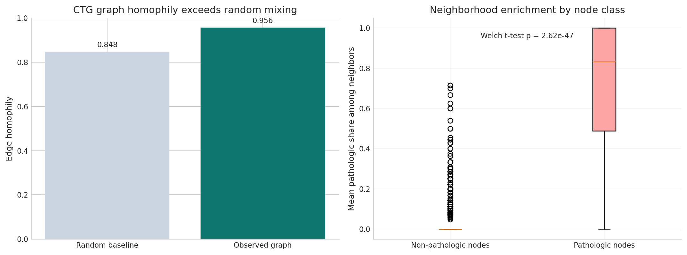

# Hybrid Quantum Graph AI for QAOA Warm-Starting and Biomedical Screening

**Molena Huynh***  
*Correspondence author

## Abstract

This manuscript presents a research-prototype study of graph-conditioned learning across two tasks that are usually developed separately: variational quantum optimization and biomedical risk prediction. The first branch evaluates whether a graph neural model can amortize depth-2 QAOA parameter selection on transcriptomic co-expression graphs, reducing repeated classical search while preserving solution quality on a small exact-simulation benchmark. The second branch evaluates whether graph message passing improves retrospective pathologic fetal-state screening on a cardiotocography similarity graph under split-first preprocessing and operating-point-aware analysis. The current prototype reports that Adaptive Quantum GCN reaches a mean held-out approximation ratio of 0.868 versus 0.869 for direct classical depth-2 optimization while retaining 99.95% of the classical benchmark quality, that Adaptive BioGCN reaches 96.71% representative held-out accuracy and 95.49% ± 0.97% fixed-split robustness, and that ResidualClinicalGCN reaches 98.8% held-out accuracy with 31 of 35 pathologic exams detected and one false positive. These results support the usefulness of a shared graph-learning framing, but they should be interpreted as evidence from an integrated prototype rather than as a finalized algorithmic or deployment-level claim. The manuscript therefore positions the work as a coherent research direction with promising empirical results and explicit next-step evaluation needs [1]-[14], [16]-[26], [35]-[60].

**Keywords:** graph neural networks, QAOA, warm-start learning, biomedical graph learning, cardiotocography, transcriptomics, MaxCut

## 1. Introduction

Graphs occupy a central role in both combinatorial optimization and biomedical machine learning, but the two settings are usually developed in isolation. In combinatorial optimization, the graph is the problem object itself: MaxCut is defined over vertices and edges, and the quality of a QAOA solution is determined by how well the circuit exploits that structure. In biomedical modeling, the graph acts as a relational inductive bias over correlated measurements, patients, or exams. Despite this difference in semantics, both settings require learning systems that can exploit structured dependencies rather than treating samples as independent rows [1-3, 15-20, 26, 35-41].

This paper asks whether graph-conditioned learning can serve as a common experimental framework across both settings. The claim is not that the two tasks are theoretically identical. The claim is that a graph-based model can occupy an analogous computational role in each domain: predicting useful QAOA parameters for a downstream variational optimizer in one case, and predicting pathologic risk from clinically structured neighborhoods in the other. Framing both problems this way makes it possible to compare how graph construction, message passing, and evaluation discipline behave under two very different operational objectives [6-14, 16-25, 35-47]. In its current form, the project should be read as a research prototype that makes this framing concrete rather than as a fully settled contribution.

The study currently makes three prototype-level contributions.

1. It demonstrates a real-data transcriptomic QAOA warm-start workflow in which Adaptive Quantum GCN reaches near-parity with direct classical depth-2 optimization on held-out graph instances while substantially reducing inference cost within the evaluated simulation regime.
2. It establishes a two-tier biomedical evaluation design in which Adaptive BioGCN functions as the reproducible benchmark model and ResidualClinicalGCN functions as the strongest operating-point model on the current retrospective cohort.
3. It shows that both branches can be organized under a single graph-learning perspective while still preserving domain-specific standards for validity, calibration, robustness, and interpretability [7-10, 24-25, 43-60].

The paper does not claim, in its present state, that these prototype-level results are sufficient on their own to establish a new algorithmic standard, a deployment-ready biomedical system, or a hardware-relevant quantum advantage result.

The rest of the paper is organized as follows. Section 2 reviews related work in variational quantum optimization, graph neural networks, and biomedical graph learning. Section 3 formalizes the problem setting. Section 4 presents the method and model roles. Section 5 describes the experimental setup. Section 6 reports the main results, including explicit baseline tables. Section 7 discusses interpretation and comparative implications. Section 8 outlines limitations and threats to validity. Section 9 covers reproducibility and broader impact. Section 10 concludes.

## 2. Related Work

### 2.1 Variational Quantum Optimization and Warm-Start Learning

Variational quantum algorithms remain one of the most actively studied paradigms for near-term quantum computing, but their practical value depends heavily on trainability, parameter concentration, and the cost of repeated classical optimization [1-5, 11-14]. Within this landscape, QAOA has become a central method for graph-structured problems such as MaxCut, and recent work has emphasized its performance characteristics, mechanisms, and implementation constraints on near-term devices [6]. A central difficulty is that strong parameters are often expensive to obtain, motivating research on warm starts, transferability, concentration phenomena, and learned initialization [7-10]. The present work contributes to that direction by focusing on transcriptomic graph families rather than synthetic random-graph transfer alone.

### 2.2 Graph Neural Networks as Structure-Aware Predictors

Graph neural networks provide a flexible family of message-passing models for node-, edge-, and graph-level prediction [15-20]. Subsequent work has characterized the expressivity of GNNs, their failure modes under oversmoothing and oversquashing, and strategies for deeper or more robust training [21-34]. These results matter directly here because the optimization branch uses a graph model to predict QAOA parameters rather than a downstream label, while the biomedical branch uses graph message passing for clinically motivated classification. In both settings, the central question is not whether graph structure exists, but whether the chosen message-passing mechanism can exploit it without collapsing under shallow inductive bias, overcompression, or unstable training [19, 21-25, 29-34].

### 2.3 Graph Learning in Biomedical Settings

Graph-based learning has already shown value in biomedical and health-related modeling, including disease prediction from population graphs, brain connectivity analysis, medication and side-effect modeling, and structured electronic health record representation learning [35-39]. More broadly, recent clinical AI literature has emphasized that strong average accuracy is insufficient for deployment-facing claims; reliable evaluation also requires attention to calibration, decision thresholds, prospective risk, distribution shift, fairness, and interpretability [40-60]. Those concerns are especially relevant for screening-oriented tasks such as pathologic fetal-state detection, where missed positives and avoidable false positives have different practical consequences.

### 2.4 Positioning of the Present Work

The contribution of this study is methodological and empirical rather than theoretical. It does not claim a deep mathematical equivalence between quantum optimization and biomedical classification. Instead, it demonstrates that graph-conditioned learning can act as a useful computational interface in both settings when graph construction is explicit, model role is carefully defined, and evaluation is matched to the downstream decision problem [7-10, 24-25, 35-47, 54-60].

Equally important, the present artifact is not yet positioned as a complete submission-ready empirical package. The current manuscript is attached to a notebook-led prototype. Its strongest value is clarifying the thesis, organizing the evidence already obtained, and making the missing evaluation steps explicit enough that the next research stage is well specified.

## 3. Problem Formulation

### 3.1 Transcriptomic QAOA Warm-Starting

The optimization branch uses a prostate expression cohort with 102 patient samples and 12,600 gene features. A reduced high-variance transcriptomic panel is used to construct weighted co-expression graphs, and each graph defines a MaxCut instance evaluated with exact depth-2 QAOA simulation. Classical optimization of QAOA angles remains expensive because each graph requires repeated objective evaluations. The corresponding learning problem is therefore to predict useful QAOA angles directly from graph structure so that optimization can be warm-started or partially amortized [6-10].

The crucial requirement is generalization across a graph family rather than memorization of a single representative graph. The primary optimization claim in this paper is therefore attached to held-out patient-resampled graphs rather than one illustrative instance.

### 3.2 Biomedical Risk Prediction

The biomedical branch uses the UCI cardiotocography cohort with 2,126 exams and 21 physiologic features. The clinically relevant task is a binary screening problem: pathologic versus non-pathologic fetal state. Instead of treating exams as independent samples, the study constructs a physiologic similarity graph so that neighboring exams can share contextual information through graph message passing [35-39].

The biomedical task is intentionally framed as retrospective screening rather than generic tabular classification. That distinction matters because the value of a model depends not only on overall accuracy but also on balanced accuracy, ROC AUC, pathologic recall, false positives, threshold behavior, and confidence calibration [43-57].

### 3.3 Research Questions

The paper is organized around three research questions.

1. Can a graph neural model predict QAOA warm-start parameters that preserve most of the quality of direct classical optimization on held-out transcriptomic graph instances?
2. Can graph-based clinical models achieve strong pathologic screening performance while remaining interpretable through robustness, threshold, and calibration analysis?
3. Can both results be presented within one graph-learning framework without weakening domain-specific evaluation discipline?

## 4. Method

### 4.1 Unified Graph-Learning Perspective

The shared framework is straightforward: graph construction is treated as part of the modeling pipeline, graph-conditioned learning is the main mechanism for structured prediction, and evaluation is explicitly task-specific. This does not imply that the quantum and biomedical tasks are interchangeable. It implies that both can be studied through the same high-level question: what useful computation can be amortized by a graph-conditioned model? [15-20, 26, 31-34]

### 4.2 Adaptive Quantum GCN

In the optimization branch, the study adapts a SimpleGCN-style backbone into a graph-conditioned predictor of QAOA parameters, referred to in the presentation layer as Adaptive Quantum GCN. The model takes graph-derived node features and adjacency information as input and outputs a set of QAOA angles. Its role is not to solve MaxCut directly. Its role is to place a downstream optimization process near a strong solution basin, consistent with the broader literature on warm starts and parameter transfer in variational optimization [7-10].

This distinction is methodologically important. A fast learned predictor is only useful if it preserves most of the classical solution quality on unseen graphs. The optimization branch therefore emphasizes held-out approximation ratio, retained quality relative to direct classical optimization, and inference-time reduction together.

### 4.3 Adaptive BioGCN

Adaptive BioGCN is the benchmark biomedical graph model. It is used to support representative held-out performance and fixed-split multi-seed robustness claims. This benchmark role matters because reproducibility and stability should not be inferred from the strongest single run alone. The benchmark therefore acts as the paper's reference biomedical configuration, analogous to the way careful baseline discipline is used in clinical machine learning studies [39, 43, 46, 47, 54, 58, 59].

### 4.4 ResidualClinicalGCN

ResidualClinicalGCN is the stronger biomedical extension used for the best operating-point analysis. It supports the highest reported held-out screening result in the study and serves as the primary model for threshold, calibration, uncertainty, and saliency interpretation. Keeping it distinct from the benchmark model prevents stability claims from being conflated with strongest-case claims [48-57].

### 4.5 Design Principles

Three design principles govern the study.

1. The graph is a modeled object, not a hidden preprocessing artifact.
2. Evaluation is domain-specific: optimization quality and speed for QAOA, robustness and screening behavior for biomedical prediction.
3. Interpretation is anchored in uncertainty, thresholding, and calibration rather than headline accuracy alone [43-60].

## 5. Experimental Setup

### 5.1 Transcriptomic Data Construction

The transcriptomic branch begins with prostate gene-expression data and reduces the feature space through variance-based selection. This produces a compact but biologically grounded graph-building panel. Edges are derived from absolute correlation structure among selected genes, producing weighted co-expression graphs that retain a biologically interpretable origin even though the downstream objective is MaxCut.

The workflow separates a representative full-cohort graph from held-out patient-resampled graphs. The representative graph supports visualization and intuition. The held-out graph family supports the main generalization claim.

### 5.2 Clinical Data Construction

The biomedical branch uses cardiotocography exams summarized through physiologic measurements. The original multiclass label space is reframed into a binary screening task centered on pathologic detection. Train, validation, and test partitions are established before feature standardization, and standardization parameters are fit only on training data. This preserves split integrity and reduces leakage risk, which is critical in clinical AI evaluation [39, 42-47, 58-60].

An exam-similarity graph is then constructed through nearest-neighbor physiologic similarity. This graph defines the local neighborhoods through which relational clinical information can be propagated.

### 5.3 Optimization Evaluation Protocol

The optimization branch reports evidence at three levels.

1. A representative graph for interpretability and visualization.
2. An adaptation setting in which the graph-conditioned predictor is exposed to transcriptomic graph resamples.
3. A held-out graph benchmark used for the main evaluation claim.

The principal metrics are approximation ratio, retained quality relative to direct classical optimization, and inference-time savings. This choice reflects the warm-start literature, where parameter quality and optimization cost must be assessed jointly [6-10].

### 5.4 Biomedical Evaluation Protocol

The biomedical branch also uses layered evaluation.

1. A representative split and seed for canonical held-out reporting.
2. A fixed-split multi-seed study for robustness to optimization randomness.
3. Threshold, calibration, and saliency analysis for operating-point interpretation.

The principal metrics are held-out accuracy, balanced accuracy, ROC AUC, pathologic recall, and confusion structure. Calibration and uncertainty are included because average discrimination alone is not sufficient for screening claims [43-57].

### 5.5 Statistical Reporting and Figure Use

The two branches produce different kinds of uncertainty and are therefore reported differently. In the optimization branch, the main uncertainty lies in graph-family variation. In the biomedical branch, uncertainty arises from class imbalance, threshold sensitivity, and stochastic training. Single-run numbers are therefore supplemented by held-out family evaluation or multi-seed robustness summaries, depending on the branch.

Figures are used as methodological evidence rather than decoration. In the optimization branch, graph and landscape visualizations motivate the warm-start problem. In the biomedical branch, confusion matrices, threshold curves, calibration views, and saliency outputs clarify how the classifier behaves as a screening model [48-57].

Table 1 summarizes the experimental protocol in compact form so that datasets, evaluation splits, and primary metrics are visible before the quantitative results.

**Table 1. Experimental protocol summary.**

| Branch | Dataset | Task | Evaluation split | Primary metrics |
|---|---|---|---|---|
| QAOA warm-start branch | Prostate transcriptomic cohort; patient-resampled co-expression graphs | Predict depth-2 QAOA warm-start angles for MaxCut | Representative full-cohort graph plus 6 held-out patient-resampled graphs | Approximation ratio, retained quality vs. classical depth-2 QAOA, inference speedup |
| Adaptive BioGCN benchmark | UCI cardiotocography cohort; 2,126 exams and 21 physiologic features | Binary pathologic vs. non-pathologic screening | Canonical train/validation/test split plus 5-seed fixed-split robustness study | Accuracy, balanced accuracy, ROC AUC |
| ResidualClinicalGCN operating point | Same CTG cohort and held-out test partition | Screening-oriented graph classification with threshold selection | Validation-selected threshold on the held-out test set | Accuracy, balanced accuracy, ROC AUC, pathologic recall, false positives |

*Figure 1. Cohort audit for the biomedical branch. The visualization summarizes how the CTG cohort separates in projected feature space, where held-out exams sit relative to the training population, and which standardized feature shifts most strongly distinguish pathologic from non-pathologic cases.*

## 6. Results

### 6.1 QAOA Warm-Start Results

The strongest optimization result appears in the transcriptomic QAOA study. Adaptive Quantum GCN reaches a mean held-out approximation ratio of 0.868, compared with 0.869 for direct classical depth-2 optimization on the same held-out graph family. This corresponds to 99.95% retention of classical benchmark quality. The study also reports approximately 1.41 × 10^4 median inference acceleration on the evaluated machine.

This result is meaningful because it combines quality preservation with computational reduction. Earlier transfer-style behavior in the same workflow was substantially weaker, around 0.573 on the held-out quality scale referenced in the optimization study. The transcriptomic adaptation stage therefore changes the optimization result qualitatively, not merely cosmetically. In the language of the QAOA warm-start literature, the model is useful because it approximates the solution quality of expensive parameter search while dramatically reducing repeated solve-time cost [7-10].

Table 2 presents the explicit optimization baseline comparison supported by the held-out transcriptomic benchmark.

**Table 2. Held-out QAOA warm-start comparison.**

| Model / condition | Mean held-out approximation ratio | Relative quality vs. classical | Evaluation role |
|---|---:|---:|---|
| Earlier transfer-style predictor | ~0.573 | ~65.9% | Pre-adaptation learned baseline on the same held-out quality scale |
| Direct classical depth-2 QAOA | 0.869 | 100.0% | Reference optimizer used for comparison |
| Adaptive Quantum GCN | 0.868 | 99.95% | Transcriptomically adapted warm-start model with ~1.41 × 10^4 median speedup |

The comparison in Table 2 is fair in scope because all three rows are interpreted on the same held-out transcriptomic quality scale, but the computational budgets differ: the classical row is a solve-time reference, whereas the learned rows are amortized predictors.

### 6.2 Adaptive BioGCN Benchmark Results

Adaptive BioGCN reaches 96.71% representative held-out accuracy, 0.943 balanced accuracy, and 0.983 ROC AUC on the canonical split. Under fixed-split multi-seed evaluation, it reports 95.49% ± 0.97% accuracy and 0.979 ± 0.003 ROC AUC. These numbers support the role of Adaptive BioGCN as the reproducible biomedical benchmark.

The importance of this benchmark is methodological. It provides a stable reference configuration against which stronger biomedical extensions can be interpreted, mirroring the emphasis on reproducible baselines in clinical machine learning and graph learning [30, 35-39, 43, 46, 54, 58, 59].

Table 3 makes the biomedical baseline comparisons explicit. The tabular rows are taken from the notebook's identical held-out split evaluation, while the graph rows summarize the benchmark and strongest graph configurations reported by the study.

**Table 3. Biomedical baseline comparison on the held-out CTG evaluation.**

| Model | Graph-aware | Accuracy | Balanced accuracy | ROC AUC | Note |
|---|---|---:|---:|---:|---|
| Logistic Regression | No | 0.9413 | 0.9030 | 0.9843 | Class-weighted linear tabular baseline |
| Random Forest (100) | No | 0.9671 | 0.8000 | 0.9951 | High ROC AUC, weaker thresholded balance on the pathologic class |
| MLP (100-50, ReLU) | No | 0.9742 | 0.8429 | 0.9945 | Feed-forward tabular baseline without class weighting |
| Adaptive BioGCN | Yes | 0.9671 | 0.9430 | 0.9830 | Reproducible benchmark graph model on the canonical split |
| ResidualClinicalGCN | Yes | 0.9883 | 0.9416 | 0.9780 | Best operating point; 31/35 pathologic exams detected with 1 false positive |

Limitations of Comparison Protocol. Table 3 should be interpreted as a controlled split-level comparison rather than a fully uniform model-selection benchmark: all methods are evaluated on the same held-out partition, but the tabular baselines, Adaptive BioGCN benchmark, and ResidualClinicalGCN screening configuration are not all selected under an identical optimization target, hyperparameter budget, or threshold-selection rule.

The comparison in Table 3 is fair with respect to held-out split reuse, but not every row is tuned for the same operational objective: Adaptive BioGCN is the reproducibility benchmark, whereas ResidualClinicalGCN is the strongest threshold-selected screening configuration.

Random Forest achieves the highest ROC AUC in Table 3 because its probability ranking over pathologic versus non-pathologic cases remains strong across thresholds, but its balanced accuracy is weaker because the default operating behavior sacrifices minority-class sensitivity once a concrete decision threshold is imposed. The graph models, especially ResidualClinicalGCN, are stronger under thresholded screening evaluation because they trade a small amount of ranking-based discrimination for materially better class balance and false-positive control at the selected operating point.

*Figure 2. Held-out evaluation for the biomedical benchmark. The figure combines the confusion structure at the selected threshold, a ROC view for pathologic detection, and the train-versus-validation learning trajectory used to assess optimization stability.*

*Figure 3. Fixed-split robustness analysis for Adaptive BioGCN. This figure supports the benchmark role of the model by showing that performance remains stable across repeated training runs rather than depending on one favorable seed.*

### 6.3 ResidualClinicalGCN Operating-Point Results

ResidualClinicalGCN produces the strongest held-out biomedical operating point in the study, reaching 98.8% accuracy, 0.942 balanced accuracy, and 0.978 ROC AUC. At the reported operating point, the model detects 31 of 35 pathologic exams while producing one false positive.

This result matters because it is decision-facing rather than purely aggregate. The model is not only accurate on average; it also supports a clinically meaningful balance between sensitivity and over-triage. Threshold analysis, calibration analysis, and saliency views help interpret whether this behavior is plausible for retrospective screening, in line with broader recommendations that high-stakes medical models be evaluated beyond accuracy alone [43-57].

*Figure 4. Operating-point analysis for ResidualClinicalGCN. The precision-recall and threshold trade-off views make the screening interpretation explicit by showing how pathologic recall changes relative to false-positive burden across candidate thresholds.*

*Figure 5. Calibration and uncertainty analysis for the biomedical branch. The reliability curves and uncertainty distributions help determine whether model confidence is aligned with retrospective screening use rather than only with average classification accuracy.*

*Figure 6. Feature-saliency comparison between the graph model and a tree-based reference view. The overlap in dominant features helps assess whether the learned pathologic signal is aligned with clinically meaningful covariates rather than arbitrary numerical artifacts.*

### 6.4 Integrated Cross-Domain Results

The combined analysis provides a compact cross-domain view of the study. It reports a representative warm-start speedup of 35,070×, an Adaptive BioGCN benchmark accuracy of 96.71%, and an integrated ResidualClinicalGCN evaluation accuracy of 96.5%. These are not uniformly the strongest numbers from each standalone branch, but they show that the same graph-learning framing can support both optimization and biomedical prediction without collapsing their evaluation criteria.

### 6.5 Interpretation of the Main Results

The optimization result is strongest when interpreted as a quality-cost trade-off: the difference between 0.868 and 0.869 approximation ratio matters because it is paired with a major reduction in repeated classical search. The biomedical result is strongest when interpreted as a screening result rather than a leaderboard result: the key value lies in pathologic detection and threshold behavior, not only in a single accuracy number. This distinction is consistent with current clinical ML guidance, which emphasizes utility, calibration, and failure analysis rather than isolated predictive performance [39, 43-47, 54-60].

For that reason, the current manuscript should not be read as proving a final unified method. It should be read as showing that the unified framing is plausible, empirically nontrivial, and worth deeper controlled evaluation.

## 7. Discussion

### 7.1 Why the Shared Framework Matters

The study shows that graph-conditioned learning can be useful across technically distinct domains when the model is assigned a role that matches the primary information bottleneck of the task. In the optimization branch, the bottleneck is repeated parameter search across related graph instances. In the biomedical branch, the bottleneck is extracting stable signal from a limited cohort in which neighborhood structure may carry useful information. The same message-passing paradigm can therefore be useful in both domains, but for different reasons [17-25, 35-39].

*Figure 7. Graph-structure validation for the biomedical branch. The pathologic-neighbor distribution and edge-homophily comparison show that the constructed exam graph contains nontrivial relational signal rather than acting as a purely cosmetic representation.*

### 7.2 Comparative Perspective

The present manuscript now includes explicit internal baseline comparisons for both branches, which makes it substantially more informative than a pure demonstration notebook. A fuller external-comparison study is still necessary before the work can support stronger research claims. In the optimization branch, the most relevant next comparisons are learned warm-start and parameter-transfer methods for variational circuits [7-10]. In the biomedical branch, broader non-graph baselines, calibration-aware tree ensembles, and simpler graph baselines should be reported under identical split-first preprocessing and threshold analysis [43]-[57].

### 7.3 Ablation Agenda

The next ablations follow directly from the current design. For the optimization branch, they include graph construction, node-feature design, adaptation schedule, and graph-family shift sensitivity. For the biomedical branch, they include neighborhood definition, residual depth, class weighting, and threshold policy. This clarity is a strength of the current artifact because it makes the next empirical steps concrete rather than speculative.

## 8. Limitations and Threats to Validity

The optimization branch is limited by exact statevector simulation and therefore by small-graph scale. Strong held-out performance on the current transcriptomic graph family does not guarantee transfer to very different graph distributions. The biomedical branch is retrospective, single-cohort, and dependent on a particular graph-construction choice. These limitations should constrain any broader claims.

Threats to validity therefore differ across branches. In the optimization branch, the central risk is graph-family overfitting. In the biomedical branch, the central risks are cohort shift, graph-construction sensitivity, overconfidence, and optimistic interpretation of retrospective metrics. The current study partially addresses these issues through held-out graph evaluation, split-first preprocessing, fixed-split robustness analysis, and threshold-aware reporting, but it does not eliminate them [24-25, 39, 43-47, 54-60].

An additional limitation is artifact maturity. Much of the strongest evidence remains notebook-driven rather than encoded in a unified experiment pipeline. That affects not only engineering convenience but also how confidently the work can be reproduced, stress-tested, and extended by third parties.

## 9. Reproducibility and Broader Impact

### 9.1 Reproducibility

All core experiments are organized so that preprocessing, model training, evaluation, and figure generation can be re-run from the accompanying code and notebooks. Raw and processed data artifacts, model code, and exported analysis figures are included with the study. This supports traceability from summary claims back to executed experiments, which is particularly important for cross-domain work where qualitative overstatement can otherwise outpace empirical support [39, 43, 58, 59].

Even so, reproducibility currently depends more heavily on notebooks than on a consolidated scriptable experiment framework. A stronger submission would promote the canonical workflows into versioned training and evaluation entry points with explicit configuration, baseline registration, and artifact tracking.

### 9.2 Ethical Considerations

The biomedical results should not be interpreted as deployment-ready clinical recommendations. Any prospective use would require external validation, calibration under distribution shift, subgroup analysis, and workflow-specific error analysis. The optimization results should likewise not be overstated as evidence of hardware-level quantum advantage. They are best interpreted as evidence that graph-conditioned learning can act as a useful warm-start mechanism within exact simulation-based evaluation [1-5, 39-47, 56, 60].

## 10. Conclusion

This paper presents a unified graph-learning framework spanning QAOA warm-start prediction and biomedical screening-oriented classification. The main empirical findings are that Adaptive Quantum GCN achieves near-classical held-out quality with substantial inference acceleration on transcriptomic graph families, that Adaptive BioGCN provides a reproducible biomedical benchmark, and that ResidualClinicalGCN reaches the strongest held-out screening operating point in the study.

The broader contribution is methodological. Cross-domain graph-learning research becomes more credible when graph construction is explicit, model roles are task-specific, and the strongest claims remain tied to reproducible experiments. Under those conditions, quantum optimization and biomedical prediction can be studied within one coherent research program without erasing the differences that make each domain scientifically distinct.

In its present state, the work is best understood as a promising research prototype with a coherent thesis, encouraging empirical signals, and a clearly identifiable next-stage agenda: tighten novelty, strengthen baselines and ablations, and move the strongest results from notebook-led evidence into a fully reproducible experimental pipeline.

## References

[1] M. Cerezo et al., "Variational quantum algorithms," *Nat. Rev. Phys.*, vol. 3, no. 9, pp. 625-644, 2021.

[2] K. Bharti et al., "Noisy intermediate-scale quantum algorithms," *Rev. Mod. Phys.*, vol. 94, no. 1, Art. no. 015004, 2022.

[3] J. Biamonte et al., "Quantum machine learning," *Nature*, vol. 549, no. 7671, pp. 195-202, 2017.

[4] J. R. McClean, S. Boixo, V. N. Smelyanskiy, R. Babbush, and H. Neven, "Barren plateaus in quantum neural network training landscapes," *Nat. Commun.*, vol. 9, Art. no. 4812, 2018.

[5] S. Wang et al., "Noise-induced barren plateaus in variational quantum algorithms," *Nat. Commun.*, vol. 12, Art. no. 6961, 2021.

[6] L. Zhou, S. Wang, S.-T. Wang, M. J. Haghighatlari, and M. D. Lukin, "Quantum approximate optimization algorithm: Performance, mechanism, and implementation on near-term devices," *Quantum*, vol. 4, Art. no. 256, 2020.

[7] D. J. Egger, J. Marecek, and S. Woerner, "Warm-starting quantum optimization," *Phys. Rev. Appl.*, vol. 15, no. 3, Art. no. 034074, 2021.

[8] A. Galda, X. Liu, D. F. Lykov, Y. Alexeev, and I. O. Tolstikhin, "Transferability of optimal QAOA parameters between random graphs," *Phys. Rev. A*, vol. 103, no. 3, Art. no. 032403, 2021.

[9] V. Akshay, D. Rabinovich, E. Campos, and J. Biamonte, "Parameter concentrations in quantum approximate optimization," *PRX Quantum*, vol. 2, no. 1, Art. no. 010348, 2021.

[10] J. Wurtz and P. J. Love, "Counterdiabaticity and the quantum approximate optimization algorithm," *Phys. Rev. A*, vol. 103, no. 4, Art. no. 042612, 2021.

[11] J. Tilly, G. Cerrillo, S. Cao, P. A. M. Casares, and A. Verma, "The variational quantum eigensolver: A review of methods and best practices," *Phys. Rep.*, vol. 986, pp. 1-128, 2022.

[12] M. Benedetti, E. Lloyd, S. Sack, and M. Fiorentini, "Parameterized quantum circuits as machine learning models," *Quantum Sci. Technol.*, vol. 4, no. 4, Art. no. 043001, 2019.

[13] M. Schuld and N. Killoran, "Quantum machine learning in feature Hilbert spaces," *Phys. Rev. Lett.*, vol. 122, no. 4, Art. no. 040504, 2019.

[14] M. Schuld, A. Bocharov, K. Svore, and N. Wiebe, "Circuit-centric quantum classifiers," *Phys. Rev. A*, vol. 101, no. 3, Art. no. 032308, 2020.

[15] F. Scarselli, M. Gori, A. C. Tsoi, M. Hagenbuchner, and G. Monfardini, "The graph neural network model," *IEEE Trans. Neural Netw.*, vol. 20, no. 1, pp. 61-80, 2009.

[16] T. N. Kipf and M. Welling, "Semi-supervised classification with graph convolutional networks," in *Proc. Int. Conf. Learn. Represent. (ICLR)*, 2017.

[17] W. L. Hamilton, R. Ying, and J. Leskovec, "Inductive representation learning on large graphs," in *Adv. Neural Inf. Process. Syst. (NeurIPS)*, 2017.

[18] P. Velickovic et al., "Graph attention networks," in *Proc. Int. Conf. Learn. Represent. (ICLR)*, 2018.

[19] K. Xu, W. Hu, J. Leskovec, and S. Jegelka, "How powerful are graph neural networks?" in *Proc. Int. Conf. Learn. Represent. (ICLR)*, 2019.

[20] J. Gilmer, S. Schoenholz, P. Riley, O. Vinyals, and G. Dahl, "Neural message passing for quantum chemistry," in *Proc. Int. Conf. Mach. Learn. (ICML)*, 2017.

[21] Q. Li, Z. Han, and X.-M. Wu, "Deeper insights into graph convolutional networks for semi-supervised learning," in *Proc. AAAI Conf. Artif. Intell. (AAAI)*, 2018.

[22] Y. Rong, W. Huang, T. Xu, and J. Huang, "DropEdge: Towards deep graph convolutional networks on node classification," in *Proc. Int. Conf. Learn. Represent. (ICLR)*, 2020.

[23] K. Oono and T. Suzuki, "Graph neural networks exponentially lose expressive power for node classification," in *Proc. Int. Conf. Learn. Represent. (ICLR)*, 2020.

[24] U. Alon and E. Yahav, "On the bottleneck of graph neural networks and its practical implications," in *Proc. Int. Conf. Learn. Represent. (ICLR)*, 2021.

[25] J. Topping, C. Di Giovanni, B. P. Chamberlain, X. Dong, and M. Bronstein, "Understanding over-squashing and bottlenecks on graphs," in *Proc. Int. Conf. Learn. Represent. (ICLR)*, 2022.

[26] Z. Wu, S. Pan, F. Chen, G. Long, C. Zhang, and S. Y. Philip, "A comprehensive survey on graph neural networks," *IEEE Trans. Neural Netw. Learn. Syst.*, vol. 32, no. 1, pp. 4-24, 2021.

[27] W. Hu et al., "Strategies for pre-training graph neural networks," in *Proc. Int. Conf. Learn. Represent. (ICLR)*, 2020.

[28] J. Klicpera, J. Grob, S. Gunnemann, and S. Giri, "Directional message passing for molecular graphs," in *Proc. Int. Conf. Learn. Represent. (ICLR)*, 2020.

[29] V. P. Dwivedi and X. Bresson, "A generalization of transformer networks to graphs," in *Proc. AAAI Conf. Artif. Intell. (AAAI)*, 2021.

[30] V. P. Dwivedi, C. K. Joshi, T. Laurent, Y. Bengio, and X. Bresson, "Benchmarking graph neural networks," *J. Mach. Learn. Res.*, vol. 24, no. 43, pp. 1-48, 2023.

[31] C. Morris et al., "Weisfeiler and Leman go neural: Higher-order graph neural networks," in *Proc. AAAI Conf. Artif. Intell. (AAAI)*, 2019.

[32] G. Corso, L. Cavalleri, D. Beaini, P. Lio, and P. Velickovic, "Principal neighbourhood aggregation for graph nets," in *Adv. Neural Inf. Process. Syst. (NeurIPS)*, 2020.

[33] M. Chen, Z. Wei, Z. Huang, B. Ding, and Y. Li, "Simple and deep graph convolutional networks," in *Proc. Int. Conf. Mach. Learn. (ICML)*, 2020.

[34] L. Zhao and L. Akoglu, "PairNorm: Tackling oversmoothing in GNNs," in *Proc. Int. Conf. Learn. Represent. (ICLR)*, 2020.

[35] S. Parisot et al., "Disease prediction using graph convolutional networks: Application to autism spectrum disorder and Alzheimer's disease," *Med. Image Anal.*, vol. 48, pp. 117-130, 2018.

[36] S. I. Ktena et al., "Metric learning with spectral graph convolutions on brain connectivity networks," *IEEE Trans. Med. Imaging*, vol. 37, no. 12, pp. 2987-2998, 2018.

[37] M. Zitnik, M. Agrawal, and J. Leskovec, "Modeling polypharmacy side effects with graph convolutional networks," *Bioinformatics*, vol. 34, no. 13, pp. i457-i466, 2018.

[38] E. Choi, M. T. Bahadori, J. Sun, J. Kulas, A. Schuetz, and W. F. Stewart, "GRAM: Graph-based attention model for healthcare representation learning," in *Proc. ACM SIGKDD Int. Conf. Knowl. Discov. Data Min. (KDD)*, 2017.

[39] A. Rajkomar et al., "Scalable and accurate deep learning with electronic health records," *npj Digit. Med.*, vol. 1, Art. no. 18, 2018.

[40] A. Esteva et al., "A guide to deep learning in healthcare," *Nat. Med.*, vol. 25, no. 1, pp. 24-29, 2019.

[41] E. J. Topol, "High-performance medicine: The convergence of human and artificial intelligence," *Nat. Med.*, vol. 25, no. 1, pp. 44-56, 2019.

[42] X. Liu et al., "A comparison of deep learning performance against health-care professionals in detecting diseases from medical imaging: A systematic review and meta-analysis," *Lancet Digit. Health*, vol. 1, no. 6, pp. e271-e297, 2019.

[43] S. Seyyed-Kalantari, G. Liu, M. McDermott, I. Y. Chen, and M. Ghassemi, "Underdiagnosis bias of artificial intelligence algorithms applied to chest radiographs in under-served patient populations," *Nat. Med.*, vol. 27, pp. 2176-2182, 2021.

[44] N. Tomašev et al., "A clinically applicable approach to continuous prediction of future acute kidney injury," *Nature*, vol. 572, no. 7767, pp. 116-119, 2019.

[45] S. M. McKinney et al., "International evaluation of an AI system for breast cancer screening," *Nature*, vol. 577, no. 7788, pp. 89-94, 2020.

[46] J. Wiens et al., "Do no harm: A roadmap for responsible machine learning for health care," *Nat. Med.*, vol. 25, no. 9, pp. 1337-1340, 2019.

[47] M. Ghassemi, T. Oakden-Rayner, and A. L. Beam, "The false hope of current approaches to explainable AI in health care," *Lancet Digit. Health*, vol. 3, no. 11, pp. e745-e750, 2021.

[48] C. Rudin, "Stop explaining black box machine learning models for high stakes decisions and use interpretable models instead," *Nat. Mach. Intell.*, vol. 1, no. 5, pp. 206-215, 2019.

[49] A. Beam and I. Kohane, "Big data and machine learning in health care," *JAMA*, vol. 319, no. 13, pp. 1317-1318, 2018.

[50] Z. Obermeyer, B. Powers, C. Vogeli, and S. Mullainathan, "Dissecting racial bias in an algorithm used to manage the health of populations," *Science*, vol. 366, no. 6464, pp. 447-453, 2019.

[51] R. Caruana, Y. Lou, J. Gehrke, P. Koch, M. Sturm, and N. Elhadad, "Intelligible models for healthcare: Predicting pneumonia risk and hospital 30-day readmission," in *Proc. ACM SIGKDD Int. Conf. Knowl. Discov. Data Min. (KDD)*, 2015.

[52] S. M. Lundberg and S.-I. Lee, "A unified approach to interpreting model predictions," in *Adv. Neural Inf. Process. Syst. (NeurIPS)*, 2017.

[53] S. M. Lundberg et al., "From local explanations to global understanding with explainable AI for trees," *Nat. Mach. Intell.*, vol. 2, no. 1, pp. 56-67, 2020.

[54] C. Guo, G. Pleiss, Y. Sun, and K. Q. Weinberger, "On calibration of modern neural networks," in *Proc. Int. Conf. Mach. Learn. (ICML)*, 2017.

[55] B. Lakshminarayanan, A. Pritzel, and C. Blundell, "Simple and scalable predictive uncertainty estimation using deep ensembles," in *Adv. Neural Inf. Process. Syst. (NeurIPS)*, 2017.

[56] Y. Gal and Z. Ghahramani, "Dropout as a Bayesian approximation: Representing model uncertainty in deep learning," in *Proc. Int. Conf. Mach. Learn. (ICML)*, 2016.

[57] J. Davis and M. Goadrich, "The relationship between precision-recall and ROC curves," in *Proc. Int. Conf. Mach. Learn. (ICML)*, 2006.

[58] D. Sculley et al., "Hidden technical debt in machine learning systems," in *Adv. Neural Inf. Process. Syst. (NeurIPS)*, 2015.

[59] P. W. Koh et al., "WILDS: A benchmark of in-the-wild distribution shifts," in *Proc. Int. Conf. Mach. Learn. (ICML)*, 2021.

[60] S. G. Finlayson, J. D. Bowers, J. Ito, J. L. Zittrain, A. L. Beam, and I. S. Kohane, "Adversarial attacks on medical machine learning," *Science*, vol. 363, no. 6433, pp. 1287-1289, 2019.